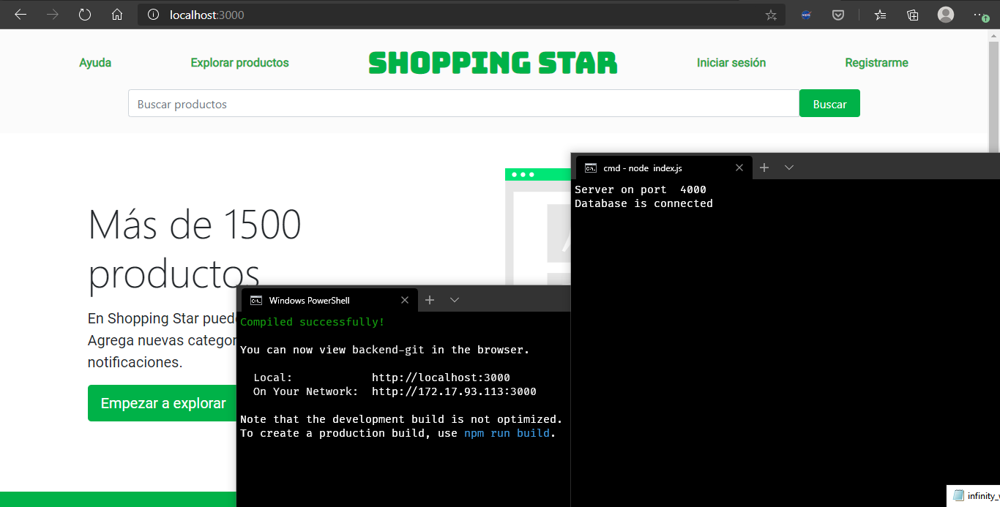

<h1 align="center"> Project </h1>
<p align="center">What does - how it does</p>

<!-- Shields -->
<!-- Languages, frameworks, design -->
<p align="center">
  <a href="https://reactjs.org/"></a>
  <a href="https://reactjs.org/"></a>
</p>




<!-- Stars -->
<p align="center">
  ⭐ Hope you liked this project. <b>Give it a star!</b><br/>
  
</p>

## 🚀 Deployment
💻 Once you have cloned or directly downloaded this repository: Open a terminal, go to the project folder and run:

📦 Install the dependencies

```bash
```

🎉 **Great! Start using or developing in the PROJECT project.**

😱 Did you have any problems in the process? Open a new Issue, following these instructions.

## 🔨 Builded with
Project was builded using:
* [Hello](https://link.com)
* [Hello](https://link.com)
* [Hello](https://link.com)

## ✍ Authors
People who contributed to the development and maintenance of the project.

* **[Name](https://github.com/user)** - @user

See also the list of [contributors](https://github.com/360macky/readme-upgrade-test/graphs/contributors) who participated in the project.

## 📃 License
Distributed under the MIT License.
See `LICENSE` for more information.
º


<!-- <h1 align="center">ShoppingStore</h1>
<p align="center">Frontend + Backend</p>
<p align="center">⚛ Aplicación en construcción 🚧</p>

## 🚀 Instrucciones
Una vez has clonado el repositorio en tu computador:

### 🔥 Enciende el backend
Dirígete a la carpeta de backend e instala las dependencias:
```bash
cd src/backend && npm install
```
Crea el archivo `.env` para las variables de entorno:
```
MONGODB_URI=mongodb://localhost/ShoppingStore
PORT=4000
```
Enciende el servidor backend:
```bash
node index.js
```
Entonces deberías ver el siguiente mensaje:
```bash
Server on port <xxxx>
Database is connected
```
Donde `<xxx>` representa el puerto del servidor. Por defecto `4000`.
### 🎨 Lanza el frontend
Dirígete a la carpeta principal del proyecto e instala las dependencias:
```bash
npm install
```
Inicia el servidor frontend:
```bash
npm start
```
### 💻 Empieza a desarrollar
Resultado esperado:


## 🐛 Problemas frecuentes
**¿Tienes un error al instalar las dependencias de NodeJS?** Elimina `package.json`, luego instálalas de nuevo utilizando `npm install`.

## ☝ Tips
Recuerda iniciar el proceso **MongoDB** utilizando:
```bash
mongodb
```

## 🖐 Desarrolladores
* [David Saavedra](https://github.com/ProgrammingGeek02)
* [Marcelo Arias]() -->
